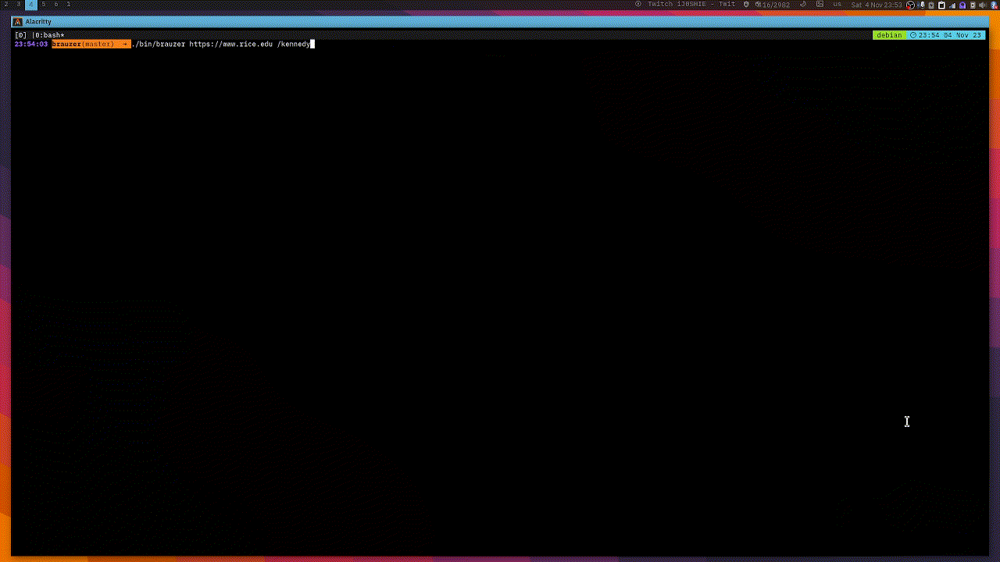
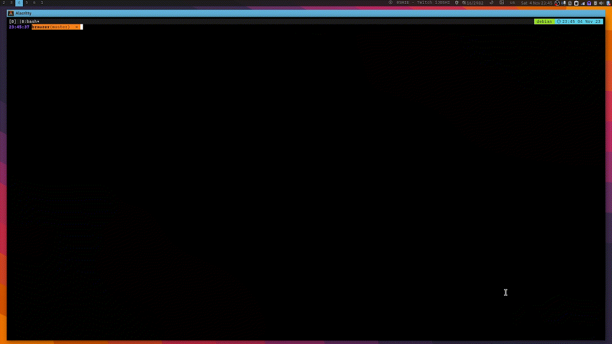
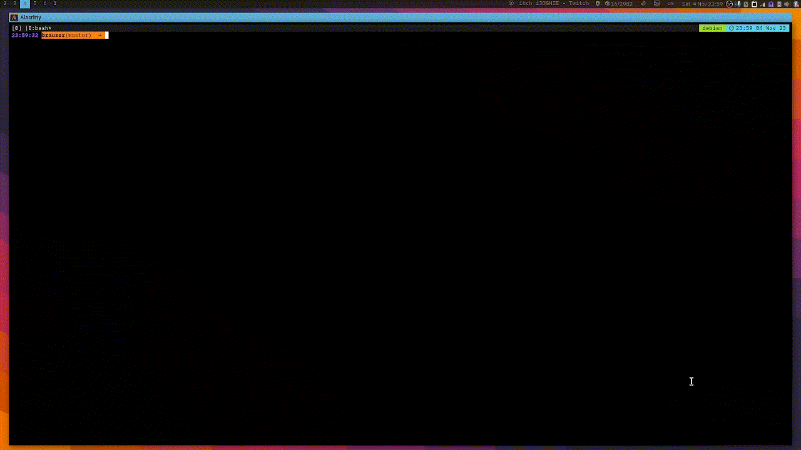

<p align="center">
  <a href="https://github.com/umutsevdi/brauzer">
  <h3 align="center">Brauzer | Браузер</h3>
  </a>

<p align="center">  
A web browser from scratch in C programming language that implements
various web protocols.
  <br/><i>Being actively developed by <a href="https://github.com/umutsevdi">
    Umut Sevdi</a></i> 
<!--<p align="center"><a href="docs.md"><strong>Explore the docs »
</strong></a></p>-->

## What is Brauzer
Brauzer is a simple web browser that can communicate through the following protocols.
* HTTP/HTTPS
* Gopher
* Gemini
I would like to build a graphical user interface with GTK framework for this project.
It can currently parse Gopher and Gemini files as of 05/11/2023.


## Demo Videos

* HTTP/HTTPS

* Gemini

* Gopher


<p id="installation">
### Installation

Requirements: 
* [OpenSSL](https://packages.debian.org/bookworm/openssl)
* [libglib2.0-0](https://packages.debian.org/bookworm/libglib2.0-0)

 Current version does not require the following packages, But the future versions will require:

* [libgtk-4](https://packages.debian.org/bookworm/libgtk-4-1)
* [libadwaita](https://packages.debian.org/bookworm/libs/libadwaita-1-0)

1. Clone the repository.

```sh
   git clone https://github.com/umutsevdi/brauzer.git
```

2. Compile the program.
```sh
    make
```

### Status

This project is currently work in progress.
#### To-do List:

- [x] TCP Session Management
- [x] TLS/SSL System
- [x] Protocol Spesific Calls
- [x] User Agent
- [x] URI Parser
- [x] CLI Interface
- [ ] **Supported Protocols**:
    - [ ] HTTP
        - [x] HTTP 1.1 Polling
        - [x] Success
        - [x] Header Parser
        - [ ] Post/Put (Partially)
        - [ ] Redirect
        - [ ] HTML Parser
        - [ ] Link Analysis and Installation
    - [x] Gemini:
        - [x] Success
        - [x] Polling
        - [x] Input
        - [x] Redirect
        - [x] Gemtext Parser
    - [x] Gopher:
        - [x] Protocol
        - [x] Parser
    - [ ] FTP/SFTP:

## 5. License

Distributed under the MIT License. See `LICENSE` for more information.

<p id="contact">

## 6. Contact

Feel free to contact me for any further information or suggestion.

Project: [umutsevdi/brauzer](https://github.com/umutsevdi/brauzer)

<i>Developed by <a href="https://github.com/umutsevdi">Umut Sevdi</a>
